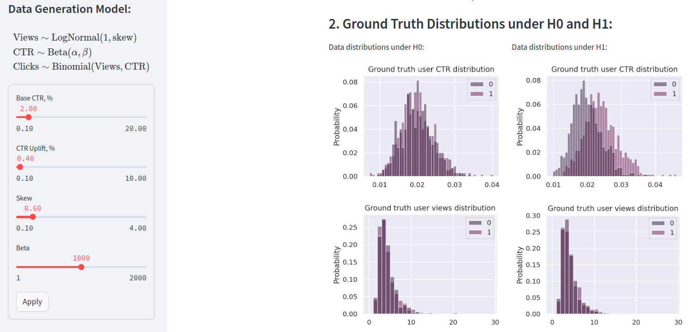

# A/B Test Simulator 🎯


An interactive A/B Testing simulator built using **Streamlit** and **Plotly**, designed for data-driven business analysis and experimentation.

### 🚀 Features
- Dynamic CTR, views, and click modeling
- Multiple statistical test comparisons
- A/A and A/B simulation runs
- Power and significance level visualization
- Clean dashboard layout inspired by Meesho internal tools

### 📸 Preview


### 🛠️ Installation
```bash
pip install -r requirements.txt
streamlit run streamlit_app.py
```

### 🧠 Use Cases
- Business/Product Analyst Dashboards
- Product Experiments
- Interview Project Demonstrations
